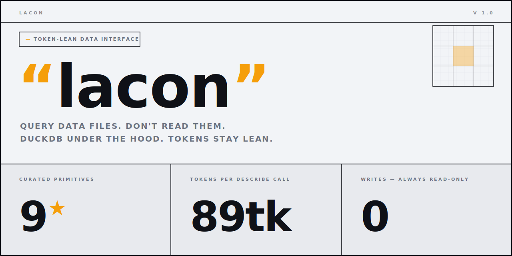

<p align="center">
  
</p>

<h1 align="center">lacon</h1>

<p align="center">
  <strong>token-lean agent↔data query interface — query files, don't read them</strong>
</p>

<p align="center">
  <a href="https://github.com/andrii-su/lacon/actions/workflows/tests.yml"></a>
  <a href="https://github.com/andrii-su/lacon/actions/workflows/pre-commit.yml"></a>
  <a href="https://github.com/andrii-su/lacon/actions/workflows/release.yml"></a>
  <a href="https://pypi.org/project/lacon/"></a>
  <a href="https://img.shields.io/badge/python-3.12%2B-3776AB"></a>
  <a href="./LICENSE"></a>
</p>

<p align="center">
  <a href="#before--after">Before/After</a> •
  <a href="#install">Install</a> •
  <a href="#what-you-get">What You Get</a> •
  <a href="#primitives">Primitives</a> •
  <a href="#hitl-for-query">HITL</a> •
  <a href="#python-api">Python API</a> •
  <a href="#cli-reference">CLI Reference</a>
</p>

______________________________________________________________________

When an agent needs to understand a CSV or Parquet file, the naive approach is to dump the whole file into context. A 5 MB CSV is ~350k tokens. `lacon` is the opposite: agents query the file and get back only the answer — shaped, capped, and token-costed. DuckDB does the querying under the hood; lacon's value is the *interface* and the *result shaping*.

Sibling to [`datoon`](https://github.com/andrii-su/datoon) (cheaper representation once data is in the prompt) — lacon's lever is to not put the data there at all.

## Before / After

<table>
<tr>
<td width="50%">

### Without lacon — dumps file into context

```python
# agent reads the whole file
content = open("sales.csv").read()
# → 350k tokens for a 5 MB file
prompt = f"Analyze this data:\n{content}"
```

</td>
<td width="50%">

### With lacon — gets only the answer

```bash
lacon describe sales.csv --pretty
```

```json
{
  "op": "describe",
  "row_count": 84000,
  "schema": [{"name": "country", "type": "VARCHAR"}, ...],
  "~tokens": 89
}
```

**89 tokens instead of 350k.**

</td>
</tr>
<tr>
<td>

### Agent wants revenue by country

```python
# without lacon — dumps rows, agent parses
rows = csv.DictReader(open("sales.csv"))
prompt = f"Sum revenue by country from:\n{list(rows)}"
# → thousands of tokens
```

</td>
<td>

### With lacon — one aggregate call

```bash
lacon aggregate sales.csv \
  --group-by country \
  --metrics revenue:sum --pretty
```

```json
{"op": "aggregate", "rows": [["UA", 4500.25], ...], "~tokens": 62}
```

</td>
</tr>
</table>

**Same answer. Tiny fraction of the token cost.**

```
┌─────────────────────────────────────────────────────┐
│  DESCRIBE A 5MB FILE    ████░░░░░░░░   89 tokens    │
│  SAME FILE DUMPED RAW   ████████████  350k tokens   │
│  WRITES ALLOWED         ░░░░░░░░░░░░   0 (read-only)│
└─────────────────────────────────────────────────────┘
```

> [!IMPORTANT]
> lacon saves tokens by **not sending data to the model** — only the answer. Savings depend on query type: `describe` is always cheap; `filter`/`sample` returns rows (but capped). Every result includes `~tokens` so agents know what they spent.

## Install

```bash
# core (CLI + DuckDB + SQL validation)
pip install lacon
uv add lacon

# with token estimates (~tokens in every response)
pip install "lacon[tokens]"

# with MCP server (coming in v0.2)
pip install "lacon[mcp]"
```

Requires Python 3.12+.

**Claude Code skill:**

```bash
claude skill install https://github.com/andrii-su/lacon/releases/latest/download/lacon.skill
```

Once installed, Claude automatically uses lacon when you mention a `.csv`, `.parquet`, or `.json` file — no manual invocation needed.

## What You Get

| | What |
|---|---|
| `lacon` **CLI** | 9 curated primitives for querying data files from terminal or scripts |
| **Python API** | `describe()`, `aggregate()`, `filter()`, `query()` — same primitives programmatically |
| **Claude Code Skill** | `/lacon` in-session trigger, progressive disclosure workflow, HITL for `query` |
| **~tokens** | Every response includes its estimated token cost (requires `lacon[tokens]`) |
| **MCP Server** | Coming in v0.2 — expose primitives as MCP tools for Claude Desktop, Cursor, Windsurf |

## Primitives

9 curated operations. Each builds safe SQL internally, enforces read-only, and applies auto-LIMIT.

| Primitive | Use when the agent asks... | Returns |
|---|---|---|
| `describe` | "what's in this file?", "what columns?", "how many rows?" | schema + metadata, **no data rows** |
| `sample` | "show me some rows", "what does the data look like?" | first/random N rows |
| `count` | "how many rows?", "how many where X?" | integer |
| `profile` | "tell me about column X", "any nulls?", "distribution?" | per-column stats |
| `distinct` | "what are the unique values of X?" | values list + truncation info |
| `aggregate` | "total/avg X by Y", "group by Z" | grouped rows |
| `filter` | "show rows where X", "find records matching Y" | matching rows, projected columns |
| `find-duplicates` | "are there duplicates?", "find duplicate X" | duplicate groups + counts |
| `query` | anything the primitives above can't express | rows — **HITL required** |

Supported formats: **CSV**, **Parquet**, **JSON**, **JSONL** — auto-detected from extension.

______________________________________________________________________

## Quick Start

```bash
# always start here
lacon describe data.csv --pretty

# understand a column
lacon profile data.csv --column revenue --pretty

# answer a count question
lacon count data.csv --where "country = 'UA'"

# group by
lacon aggregate data.csv --group-by country --metrics revenue:sum --pretty

# filter with column projection
lacon filter data.csv --where "year = 2024" --columns name revenue --pretty

# unique values
lacon distinct data.csv --column country --pretty

# find duplicates
lacon find-duplicates data.csv --columns email --pretty

# escape hatch — use HITL (see below)
lacon query data.csv "SELECT country, AVG(revenue) FROM {file} GROUP BY country" --show-sql --pretty
lacon query data.csv "SELECT country, AVG(revenue) FROM {file} GROUP BY country" --pretty
```

Use `{file}` as the placeholder for the data source in `query`. Auto-LIMIT is always enforced (default 50, max 1000).

______________________________________________________________________

## HITL for `query`

The `query` primitive runs arbitrary SQL — an escape hatch when curated primitives aren't enough. Because the SQL is not predictable from fixed parameters, **always preview before executing**.

```bash
# Step 1 — preview resolved SQL (no execution)
lacon query sales.csv \
  "SELECT country, name, revenue FROM {file} t \
   WHERE revenue = (SELECT MAX(revenue) FROM {file} t2 WHERE t2.country = t.country) \
   ORDER BY revenue DESC" \
  --show-sql --pretty
```

```json
{
  "op": "query",
  "sql": "SELECT country, name, revenue FROM read_csv('sales.csv') t WHERE ...",
  "will_execute": false
}
```

```bash
# Step 2 — confirm the SQL, then execute
lacon query sales.csv "..." --pretty
```

Result always includes the `sql` field so you can verify what ran:

```json
{
  "op": "query",
  "schema": ["country", "name", "revenue"],
  "rows": [["UA", "Bob", 3400.0], ...],
  "shown": 3,
  "~tokens": 74,
  "sql": "SELECT country, name, revenue FROM read_csv('sales.csv') t WHERE ..."
}
```

**Why:** text-to-SQL agents achieve ~80% accuracy on real schemas. A subtly wrong WHERE clause executes silently and looks correct. Showing the SQL before execution catches errors before they produce wrong answers. Curated primitives need no confirmation — their SQL is fully determined by parameters.

______________________________________________________________________

## Output Envelope

Every response is a shaped JSON object:

```json
{
  "op": "aggregate",
  "schema": ["country", "sum_revenue"],
  "rows": [["UA", 4500.25], ["DE", 2200.0], ["US", 2001.25]],
  "shown": 3,
  "~tokens": 62
}
```

| Field | Description |
|---|---|
| `op` | Which primitive ran |
| `schema` | Column names — agent never guesses shape |
| `rows` | Data as arrays — compact, no key repetition |
| `shown` | How many rows returned (honest truncation) |
| `~tokens` | Estimated token cost of this response (`lacon[tokens]`) |
| `sql` | Resolved SQL that ran (`query` only) |

`describe` returns metadata only (no rows). `count` returns a single integer.

______________________________________________________________________

## Python API

```python
from lacon import DuckDBEngine, describe, sample, count, aggregate, filter, query

with DuckDBEngine() as engine:
    # schema + metadata
    r = describe("data.csv", engine)
    print(r["row_count"], r["schema"])

    # column stats
    r = profile("data.csv", column="revenue", engine=engine)
    print(r["min"], r["max"], r["mean"])

    # grouped aggregation
    r = aggregate(
        "data.csv",
        group_by=["country"],
        metrics=[{"col": "revenue", "fn": "sum"}],
        engine=engine,
    )

    # filtered rows with projection
    r = filter("data.csv", where="revenue > 2000", columns=["name", "revenue"], engine=engine)

    # escape hatch — read-only, auto-LIMIT
    r = query("data.csv", "SELECT country, AVG(revenue) FROM {file} GROUP BY country", engine=engine)
```

______________________________________________________________________

## Safety

- **Read-only** — no writes, no DDL, no COPY, no INSTALL
- **SQL validation** — sqlglot parses every `query` call; rejects INSERT, DROP, CREATE, multi-statement
- **Auto-LIMIT** — injected if missing, capped at 1000
- **Path escaping** — single quotes in paths escaped before DuckDB

______________________________________________________________________

## CLI Reference

### Options

| Flag | Scope | Description |
|---|---|---|
| `--version` | top-level: `lacon --version` | Print version and exit |
| `--pretty` | per-command: `lacon describe data.csv --pretty` | Indent JSON output (default is compact, token-lean) |

### `describe <path>`

Schema, row count, file size. Always start here.

### `sample <path>`

| Flag | Default | Description |
|---|---|---|
| `--n N` | 5 | Number of rows |
| `--random` | false | Random sample instead of first N |

### `count <path>`

| Flag | Description |
|---|---|
| `--where EXPR` | Optional WHERE filter |

### `profile <path>`

| Flag | Description |
|---|---|
| `--column COL` | Column to profile (required) |
| `--top-k N` | Top-k values for categorical columns (default 10) |

### `aggregate <path>`

| Flag | Description |
|---|---|
| `--group-by COL [COL ...]` | Group-by columns |
| `--metrics COL:FN [...]` | Metrics — fn ∈ `sum avg min max count` |
| `--where EXPR` | Optional WHERE filter |
| `--limit N` | Row cap (default 50) |

### `filter <path>`

| Flag | Description |
|---|---|
| `--where EXPR` | WHERE filter (required) |
| `--columns COL [...]` | Column projection |
| `--limit N` | Row cap (default 50) |

### `distinct <path>`

| Flag | Description |
|---|---|
| `--column COL` | Column to enumerate (required) |
| `--limit N` | Value cap (default 50) |

### `find-duplicates <path>`

| Flag | Description |
|---|---|
| `--columns COL [...]` | Key columns (required) |
| `--limit N` | Group cap (default 50) |

### `query <path> SQL`

| Flag | Description |
|---|---|
| `--limit N` | Row cap (default 50, max 1000) |
| `--show-sql` | Preview resolved SQL without executing (HITL) |

Use `{file}` as the data-source placeholder in SQL.

______________________________________________________________________

## Development

```bash
# setup
uv sync --extra dev
uvx pre-commit install

# tests (46 — primitives, safety, shaping)
uv run --with ".[dev,tokens]" pytest

# build lacon.skill for distribution
python scripts/build_skill.py
```

______________________________________________________________________

## Links

- [CONTRIBUTING.md](./CONTRIBUTING.md) — contributor workflow
- [CLAUDE.md](./CLAUDE.md) — agent/maintainer context
- [CHANGELOG.md](./CHANGELOG.md) — release history
- [SECURITY.md](./SECURITY.md) — vulnerability reporting
- [Live docs](https://andrii-su.github.io/lacon/) — `docs/`
- [Issues](https://github.com/andrii-su/lacon/issues) — bugs, features, questions

______________________________________________________________________

## License

MIT
